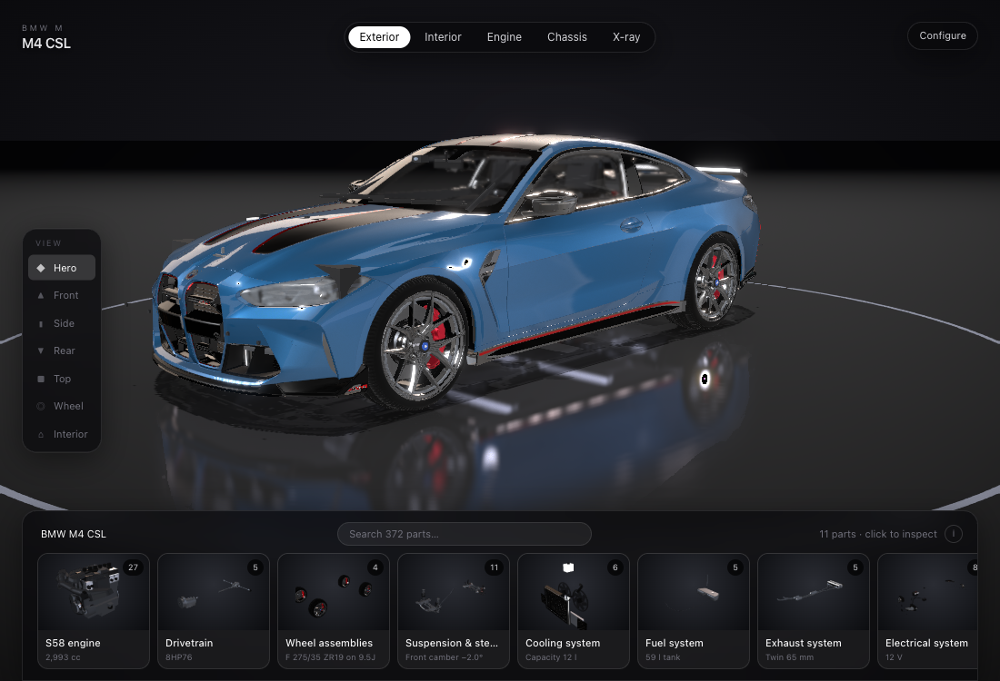
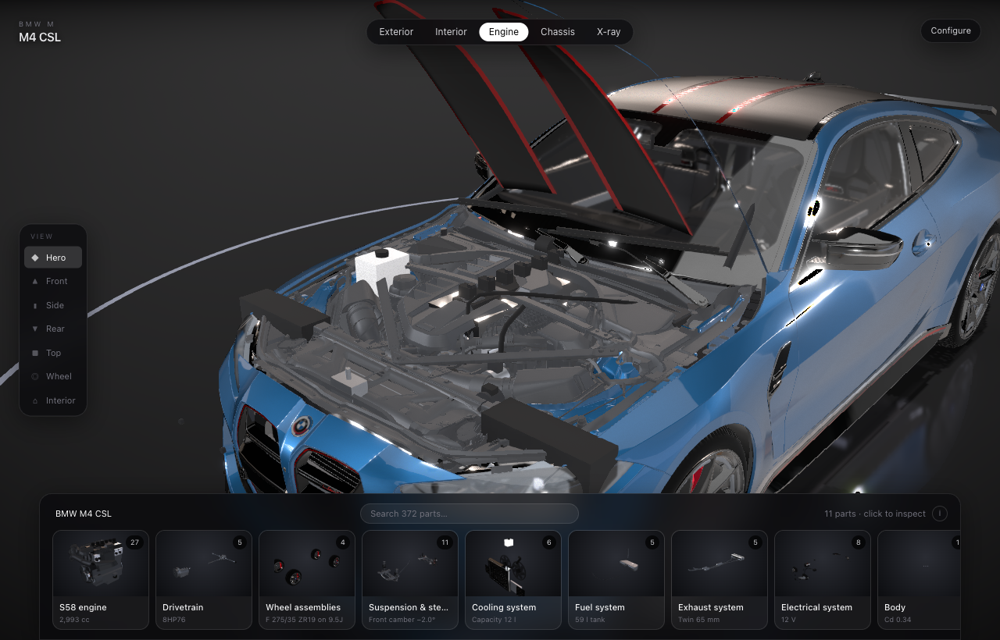
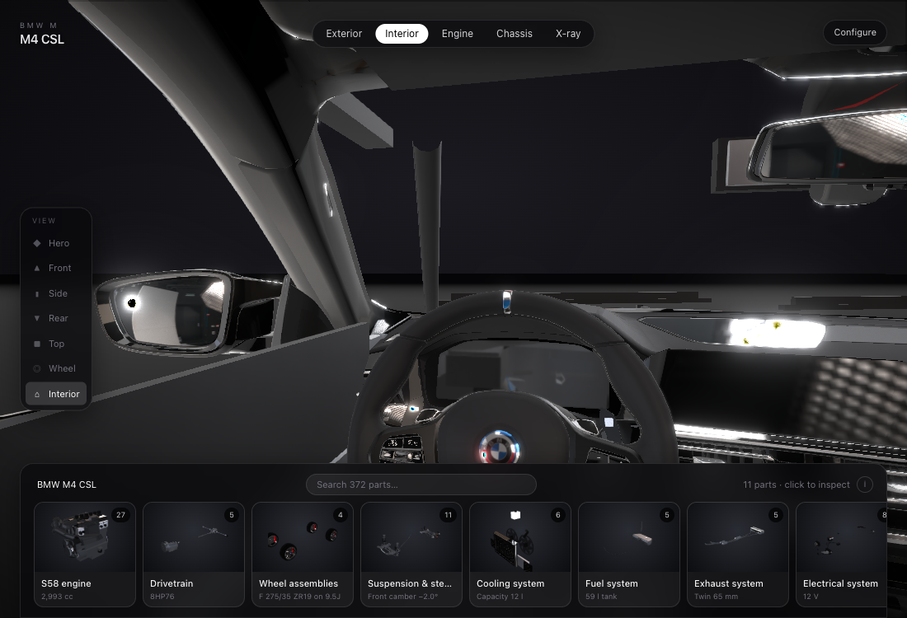

<h1 align="center">BMW M4 CSL · 3D Configurator</h1>

<p align="center">
  A browser car configurator that goes all the way down: 372 parts across 11 subsystems,
  each one clickable, spec'd and explorable inside a real 3D model.
</p>

<p align="center">
  
</p>

<p align="center">
  <sub>Built with React · TypeScript · three.js · react-three-fiber · Zustand · Tailwind</sub>
</p>

---

## What this is

Most car configurators let you change the paint. This one lets you open the car up.

Pick a view mode and the body ghosts away to show the drivetrain. Drill into the engine,
then into the turbochargers, then into a single wastegate, and the camera flies to it while
a panel tells you what it is, what it does, what it's made of, what it's rated for and what
usually goes wrong with it. Every part in the tree resolves to real geometry in the scene —
if it exists in the model it's mapped to it, and if it doesn't (pistons, gear sets, coil
springs, wiring) it's built procedurally and placed where it belongs.

| | |
| --- | --- |
|  |  |
| **Engine** — hood opens, camera moves to the bay | **Interior** — first-person from the driver's seat |

## Quick start

```bash
npm install
npm run dev      # http://localhost:5173
npm run build    # static bundle in dist/
```

No backend, no API keys, no build step for the assets. The model and HDRIs are in `public/`.

## Features

**Explore**
- 372 parts in a four-level tree: car → subsystem → assembly → part
- Click any card, or any mesh in the 3D view, to select it; double-click to drill in
- Detail panel with description, function, material, spec, maintenance note and a typical price
- Search jumps straight to a part; hover names anything under the cursor
- Per-assembly exploded view, plus "show in context" to ghost or hide the rest of the car

**View**
- Five modes: Exterior, Interior (first-person, clamped look-around), Engine, Chassis (grid floor, camera underneath), X-ray
- Seven camera presets with eased fly-to transitions
- Driver door, hood and trunk open on their real hinge lines
- Dimensions overlay, drive mode, hazards, cinematic tour, photo mode

**Configure**
- Ten named paints plus a custom picker, in gloss / satin / matte / metallic-flake
- Wheel and caliper colours, window tint, interior trim, cabin ambient lighting
- Ride height and wheel size, lights, four environments
- Build summary with a price breakdown, and the whole configuration lives in the URL

**Under the hood**
- Meshopt-compressed GLB (3.5 MB), subsystems built lazily on first drill-in
- Adaptive resolution: DPR steps down, then ambient occlusion drops, if frames get slow
- Rendering pauses when the tab is hidden
- Clearcoat paint with a flake normal map, transmission glass, tread-normal-mapped tyres,
  ACES tone mapping, 2K HDRI plus area-light style rim lights, bloom, SMAA, film grain,
  depth of field on small parts

## Keyboard

| Key | Action | | Key | Action |
| --- | --- | --- | --- | --- |
| `1`–`5` | View modes | | `←` `→` | Previous / next sibling part |
| `D` | Driver door | | `Enter` `↓` | Open the selected assembly |
| `H` | Hood | | `Backspace` `↑` | Up a level |
| `T` | Trunk | | `Space` | Cinematic tour |
| `L` | Lights | | `P` | Photo mode (hide the UI) |
| `V` | Drive | | `R` | Reset |
| `M` | Dimensions | | `Esc` | Close panels |

## Project structure

```
src/
├── main.tsx            entry
├── App.tsx             layout, keyboard shortcuts, tour, build summary
├── app.css             design tokens: one glass surface, one radius, 8px scale
├── store.ts            configuration + UI state, URL sync, camera presets
├── data/
│   └── parts.ts        the 372-part hierarchy, with specs and GLB node mappings
├── scene/
│   ├── Scene.tsx       canvas, environment, floor, post-processing, thumbnails
│   ├── Car.tsx         loads the GLB, re-orients it, materials, hinges, wheels, picking
│   ├── Controls.tsx    orbit controls, camera tweening, per-mode clamps
│   ├── registry.ts     part id → scene objects; lazy per-subsystem builds
│   └── build/
│       ├── kit.ts      geometry helpers (gears, springs, tubes) and shared materials
│       └── systems.ts  procedural sub-assemblies for everything the model lacks
└── ui/
    ├── Explorer.tsx    parts rail, breadcrumb, detail panel, search
    ├── Configurator.tsx  paint/wheels/lighting panel and camera presets
    └── thumbs.ts       part thumbnail cache, rendered one per frame
```

### How a part becomes geometry

`data/parts.ts` is the single source of truth. Each entry declares its copy and, optionally,
which mesh in the GLB it maps to:

```ts
p('engine.turbo.t1.wastegate', 'Wastegate',
  'Electrically actuated flap in the turbine housing.',
  'Bypasses exhaust around the turbine to cap boost.',
  'Stainless flap, electric actuator',
  'Actuator travel 12 mm · 0–100 % in 120 ms',
  'Rattle at idle is a worn flap pivot.', 380)
```

`scene/registry.ts` resolves every id to objects in the scene: parts with a `node` bind to
the model's own meshes, everything else is built by `scene/build/systems.ts` and placed in
world coordinates. A part with no geometry is a build error, not a silent gap — the check
below fails on it.

## Verification

Everything is checked headlessly against a running dev server. Screenshots and interaction
tests use Playwright with SwiftShader, so they run without a GPU.

```bash
node --experimental-strip-types scripts/parts-stats.mjs   # tree sanity, counts per subsystem
node scripts/check-parts.mjs                              # fails if any part id has no mesh
node scripts/ui-check.mjs                                 # every control fires; no panel overlaps, at 3 widths
node scripts/audit-fit.mjs                                # flags parts escaping the shell or the cabin
node scripts/diff-proc.mjs                                # renders with/without procedural parts and diffs
node scripts/pick.mjs                                     # names the part under given pixels
node scripts/shots.mjs after                              # screenshots at 1920 / 1440 / mobile
node scripts/one.mjs "?mode=xray" out.png                 # single render of any URL state
```

`diff-proc` is the one that earns its keep: anything procedural that becomes visible from
outside closed bodywork shows up as a changed pixel, which is how a floating roof panel and
a mis-rotated steering wheel were found.

## Deep links

Any state can be shared as a URL: `?mode=engine`, `?view=wheel`, `?part=engine.pistons.p1`,
`?door=1&hood=1&trunk=1`, `?dims=1`, `?paint=e4c400&finish=satin&env=sunset`,
`?explode=0.8&scope=engine`.

## Swapping the model

The app loads whatever sits at `public/models/car.glb`. Part names in `data/parts.ts` (the
`node` fields) and the world coordinates in `scene/build/systems.ts` follow this particular
model, so a different car needs those updated — `scripts/check-parts.mjs` tells you exactly
which ids came loose.

## Known limitations

- **Frame rate is unverified on real hardware.** Every visual check here ran under software
  rendering, which is about one frame per second and says nothing about GPU performance. The
  adaptive-quality path exists but the 60 fps target has not been measured.
- Part specifications are compiled from published figures for a reference S58-powered M4 CSL.
  They are illustrative, not service data.
- Some sub-parts share geometry with their parent where the model doesn't separate them, so
  selecting one can highlight a slightly larger piece than its name implies.

## Licence

Code is [MIT](LICENSE). The 3D model is CC BY 4.0 and the HDRIs are CC0 — see
[ATTRIBUTION.md](ATTRIBUTION.md) for full credits and the changes made to the model.

Not affiliated with BMW.
